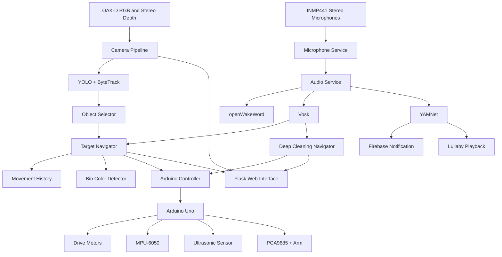

# Toy-Sorting Mobile Robot

An autonomous mobile robot built around a Raspberry Pi 5 and Arduino Uno that can detect and sort toy objects, perform a ZikZak room-coverage movement pattern, respond to voice commands, detect possible baby crying, play lullabies, and send Firebase notifications.

The project combines computer vision, stereo depth, ultrasonic sensing, IMU-controlled movement, a robotic arm, voice recognition, audio classification, and a Flask web interface.

---

## Main Features

The current project supports four main capabilities:

1. **Autonomous toy sorting**
   - Detect toys with a custom YOLO model.
   - Track detections with ByteTrack.
   - Confirm a stable target.
   - Navigate toward the object.
   - Pick it up using the robotic arm.
   - Return toward the starting/bin area.
   - Detect the correct colored bin.
   - Release the object.
   - Automatically begin another sorting cycle.

2. **Deep-cleaning / ZikZak navigation**
   - Drive through multiple room lanes.
   - Stop near a wall using the ultrasonic sensor.
   - Turn into the next lane.
   - Shift sideways by a calibrated amount.
   - Alternate travel direction between lanes.
   - Stop after the configured maximum number of lanes.

3. **Voice commands**
   - Wake word: `Hey Robo`
   - Supported commands:
     - `start navigation`
     - `start deep cleaning`
     - `stop`
     - `cancel`

4. **Baby monitoring**
   - Detect possible baby crying using YAMNet.
   - Send a Firebase Cloud Messaging notification.
   - Stop microphone capture temporarily.
   - Play a lullaby through the Raspberry Pi audio output.
   - Restart microphone monitoring when playback finishes.

---

## Hardware

The current robot uses:

- Raspberry Pi 5.
- Luxonis OAK-D depth camera.
- Arduino Uno.
- L298N dual H-bridge motor driver.
- Four DC TT motors.
- Four-wheel mobile chassis.
- MPU-6050 accelerometer and gyroscope.
- Ultrasonic distance sensor.
- PCA9685 16-channel PWM servo controller.
- Multi-servo robotic arm and gripper.
- Two INMP441 I2S microphones.
- Speaker or Bluetooth/audio-output device.
- Separate regulated power supplies for computing, motors, and servos.

---

# System Architecture



---

# Raspberry Pi Responsibilities

The Raspberry Pi performs the high-level processing and behavior control.

It:

- Runs the OAK-D camera pipeline.
- Processes RGB and stereo-depth frames.
- Runs YOLO object detection.
- Runs ByteTrack tracking.
- Confirms stable targets.
- Controls object-navigation decisions.
- Maintains movement history.
- Detects colored destination bins.
- Coordinates pickup, return, release, and repeated sorting cycles.
- Runs deep-cleaning/ZikZak navigation.
- Captures stereo microphone audio.
- Detects the `Hey Robo` wake word.
- Recognizes robot commands with Vosk.
- Detects possible baby crying using YAMNet.
- Plays lullabies.
- Sends Firebase notifications.
- Hosts the Flask monitoring and control interface.

---

# Arduino Responsibilities

The Arduino handles low-level physical hardware control.

It:

- Controls the L298N motor driver.
- Executes forward and backward movement.
- Executes IMU-controlled turns.
- Runs heartbeat-protected continuous forward movement.
- Reads ultrasonic distance.
- Reads and calibrates the MPU-6050.
- Controls the PCA9685 servo driver.
- Controls the robotic arm and gripper.
- Performs pickup positioning.
- Performs grab, lift, and release sequences.
- Accepts an interrupting `STOP` command.
- Returns structured responses to the Raspberry Pi over USB serial.

---

# Autonomous Toy Sorting

## Object Detection

The active detection system uses a custom Ultralytics YOLO model located at:

```text
models/oak/best.pt
```

The model file is not stored in Git and must be installed manually.

The custom ByteTrack configuration is located at:

```text
config/trackers/bytetrack_robot.yaml
```

The detector provides information including:

- Class label.
- Confidence.
- Bounding box.
- Center coordinates.
- Track information.
- Stereo-depth estimate when available.

---

## Supported Object Classes

| Detected class | Destination | Bin color |
|---|---|---|
| `animal` | `animal` | Yellow |
| `toy_car` | `toy_car` | Red |
| `building_block` | `building_block` | Blue |
| Low-confidence confirmed target | `discharge` | Black |

A low-confidence target that still passes the minimum confirmation requirements is sent to the black discharge bin.

---

## Target Confirmation

The object selector confirms a target over multiple frames instead of immediately driving toward the first detection.

Current behavior includes:

- Minimum usable confidence around `0.20`.
- Normal confidence threshold around `0.40`.
- Normal confirmation using multiple consecutive frames.
- Additional confirmation for uncertain detections.
- Spatial consistency checks between frames.

The largest stable visible candidate is preferred.

---

## Object Navigation

The main target-navigation implementation is:

```text
robot_project/navigation/target_navigator.py
```

The navigator:

1. Locks the confirmed object and destination.
2. Aligns horizontally using the camera.
3. Moves toward the object.
4. Monitors target freshness and alignment.
5. Uses ultrasonic measurements at close range.
6. Positions the robot for pickup.
7. Commands the Arduino arm sequence.
8. Records robot movements.
9. Estimates a return route.
10. Finds the correct destination bin.
11. Aligns with the bin.
12. Approaches the bin.
13. Releases the object.
14. Resets for another sorting cycle.

---

# Return Navigation

Robot movements are stored by:

```text
robot_project/navigation/movement_history.py
```

The current return system uses dead reckoning.

It estimates:

- Final X/Y position.
- Robot heading.
- Bearing back toward the origin.
- Approximate return distance.

The result is affected by:

- Wheel slip.
- Floor material.
- Motor differences.
- Battery voltage.
- Robot payload.
- Wheel diameter.
- Movement calibration.

The system currently does not use wheel encoders or external localization.

---

# Deep Cleaning / ZikZak Mode

Deep-cleaning navigation is implemented in:

```text
robot_project/navigation/deep_cleaning_navigator.py
```

This mode is separate from target-search navigation.

Target navigation and deep cleaning cannot run at the same time.

---

## Movement Pattern

The current ZikZak pattern works as follows:

1. Start in lane 1.
2. Drive forward while monitoring ultrasonic distance.
3. Stop when the wall reaches the configured minimum distance.
4. Turn toward the next lane.
5. Move forward briefly to shift sideways.
6. Turn again in the same direction.
7. Drive the next lane in the opposite longitudinal direction.
8. Repeat the process.
9. Stop when the configured number of lanes is completed.

Odd and even lanes alternate between traveling away from and toward the starting/bin side.

---

## Current Deep-Cleaning Calibration

The current values in `deep_cleaning_navigator.py` are:

```text
Wall stop distance:       25 cm
Maximum lane drive time:  8 seconds
First turn angle:         85 degrees
Second turn angle:        83 degrees
Lane shift duration:      400 ms
Maximum lanes:            4
```

These are physical calibration values and should be changed only after observing the real robot.

The lane shift is controlled by:

```python
LANE_SHIFT_DURATION_MS = 400
```

Increase this value if the robot needs to move farther sideways between lanes.

Decrease it if the lane spacing is too large.

The maximum number of lanes is controlled by:

```python
MAX_LANES = 4
```

The temporary lane safety timeout is controlled by:

```python
MAX_LANE_DRIVE_SECONDS = 8.0
```

A lane that does not reach a wall within this time stops with a safety timeout.

---

# Audio System

Audio-related code is located in:

```text
robot_project/audio/
```

Important files include:

```text
audio_service.py
config.py
cry_detector.py
microphone.py
speaker.py
speech_recognizer.py
wake_word.py
```

---

## Microphones

The robot currently uses two INMP441 I2S microphones.

The configured capture format is:

```text
Sample rate: 16000 Hz
Channels: 2
Format: signed 16-bit PCM
```

`robot_project/audio/microphone.py` captures stereo audio and converts it to mono before sending it to the AI models.

The configured sound-device name is:

```text
inmp441
```

---

## INMP441 Device-Tree Overlay

The repository includes:

```text
inmp441-stereo.dts
```

This defines the Raspberry Pi I2S stereo microphone device.

After configuring the overlay on the Raspberry Pi, confirm that the audio device is available with tools such as:

```bash
arecord -l
```

The Python audio system expects the INMP441 input device to be available to PortAudio/sounddevice.

---

# Voice Commands

Voice control uses two systems:

```text
openWakeWord -> wake-word detection
Vosk         -> command recognition
```

The configured wake word is:

```text
Hey Robo
```

After the wake word is detected, the system listens for a command.

Supported commands are:

```text
start navigation
start deep cleaning
stop
cancel
```

`stop` and `cancel` trigger the emergency-stop behavior.

---

# Audio Models

Audio AI models are intentionally excluded from Git.

The `.gitignore` contains:

```text
models/audio/
```

You must install these models manually on the Raspberry Pi.

---

## Vosk Model

Expected location:

```text
models/audio/vosk/vosk-model-small-en-us-0.15/
```

The directory should contain the normal Vosk model files.

---

## openWakeWord Model

Expected custom model:

```text
models/audio/openwakeword/hey_robo.onnx
```

If this file does not exist, the wake-word detector will fail during startup.

---

## YAMNet Model

YAMNet is expected under:

```text
models/audio/yamnet/
```

The cry detector searches this directory for a subdirectory containing:

```text
saved_model.pb
```

---

# Baby-Cry Detection

Baby-cry detection is implemented by:

```text
robot_project/audio/cry_detector.py
```

The current system uses YAMNet's:

```text
Baby cry, infant cry
```

class.

The current detection threshold is:

```text
0.25
```

Audio is accumulated into approximately one-second windows before being processed.

When crying is detected:

1. A Firebase notification is sent.
2. Microphone capture is stopped temporarily.
3. A lullaby is played.
4. The audio service is reset.
5. Microphone monitoring starts again.

---

# Lullaby Playback

The current songs are stored in:

```text
robot_project/audio/sounds/
```

Current files include:

```text
twinkle-twinkle-little-star.mp3
baby-shark.mp3
```

A song is selected randomly.

Playback uses:

```text
ffplay
```

Therefore FFmpeg must be installed on the Raspberry Pi.

Example:

```bash
sudo apt update
sudo apt install -y ffmpeg
```

---

# Firebase Notifications

Firebase Cloud Messaging is used to notify another device when possible baby crying is detected.

The service-account file is expected at:

```text
config/firebase-service-account.json
```

This file is intentionally ignored by Git and must be installed manually.

Do **not** commit Firebase service-account credentials.

The current application initializes Firebase during robot startup, so the service-account file must exist before running `main.py`.

There is also a test script:

```text
test_firebase_notification.py
```

The current application code contains an FCM device token directly in the Python source. For a production deployment, move device tokens and secrets into environment variables or another local configuration source instead of committing them to Git.

---

# Web Interface

The Flask application runs on:

```text
0.0.0.0:5000
```

Start the robot with:

```bash
python main.py
```

Then open:

```text
http://<raspberry-pi-ip>:5000
```

---

## Current Endpoints

| Endpoint | Purpose |
|---|---|
| `/` | Main robot-control and camera page |
| `/video` | Annotated RGB video |
| `/depth` | Depth visualization |
| `/capture` | Dataset capture interface |
| `/capture_video` | Raw capture stream |
| `/save` | Save current camera frame |
| `/status` | Main system status |
| `/navigation/start` | Start autonomous toy navigation |
| `/navigation/stop` | Stop target navigation |
| `/navigation/return` | Start manual return behavior |
| `/navigation/status` | Detailed navigation status |
| `/deep-cleaning/start` | Start ZikZak deep-cleaning mode |
| `/deep-cleaning/stop` | Stop deep-cleaning mode |
| `/deep-cleaning/status` | Deep-cleaning state and calibration |
| `/emergency-stop` | Stop target navigation, deep cleaning, and motors |
| `/audio/lullaby/play` | Manually play a baby lullaby |

---

# Emergency Stop

The emergency-stop route is:

```text
/emergency-stop
```

It:

1. Requests target navigation to stop.
2. Requests deep-cleaning navigation to stop.
3. Sends a direct motor stop to the Arduino.

Always keep a physical power-disconnect method available during testing.

Software emergency stops should not be treated as a replacement for safe electrical and mechanical design.

---

# Arduino Pin Assignment

| Function | Arduino pin |
|---|---:|
| L298N ENA | D6 |
| L298N ENB | D5 |
| L298N IN1 | D8 |
| L298N IN2 | D9 |
| L298N IN3 | D10 |
| L298N IN4 | D11 |
| Ultrasonic TRIG | D2 |
| Ultrasonic ECHO | D3 |
| I2C SDA | A4 |
| I2C SCL | A5 |

The MPU-6050 and PCA9685 share the Arduino I2C bus.

---

# PCA9685 Servo Channels

| Joint | Channel | Current software limits |
|---|---:|---:|
| Base | 0 | `0-180 degrees` |
| Shoulder | 4 | `0-180 degrees` |
| Elbow | 8 | `10-130 degrees` |
| Gripper | 12 | `95-170 degrees` |

Current gripper positions:

```text
Grab/Hold:    100 degrees
Open/Release: 160 degrees
```

Do not widen servo limits without checking the arm mechanically.

---

# Power Requirements

Use separate regulated power paths where appropriate.

- Raspberry Pi: suitable Raspberry Pi power supply or UPS.
- Motors: motor supply through the L298N.
- Servos: regulated servo supply connected to PCA9685 `V+`.
- PCA9685 logic: controller logic voltage connected to `VCC`.
- All communicating control systems must share an appropriate common ground.

Do not power the full servo rail from the Arduino or Raspberry Pi 5 V pin.

Do not directly connect two independent regulated 5 V power outputs together.

---

# Repository Structure

```text
RobotProject/
├── arduino/
│   ├── communication_test/
│   │   └── communication_test.ino
│   └── robot_controller/
│       └── robot_controller.ino
│
├── config/
│   ├── trackers/
│   │   └── bytetrack_robot.yaml
│   └── firebase-service-account.json   # local, ignored by Git
│
├── models/
│   ├── oak/
│   │   ├── README.md
│   │   └── best.pt                    # local, ignored by Git
│   └── audio/                         # local, ignored by Git
│       ├── vosk/
│       ├── openwakeword/
│       │   └── hey_robo.onnx
│       └── yamnet/
│
├── robot_project/
│   ├── audio/
│   │   ├── audio_service.py
│   │   ├── config.py
│   │   ├── cry_detector.py
│   │   ├── microphone.py
│   │   ├── speaker.py
│   │   ├── speech_recognizer.py
│   │   ├── wake_word.py
│   │   └── sounds/
│   │
│   ├── camera/
│   │   ├── depth.py
│   │   ├── device.py
│   │   ├── fps.py
│   │   └── pipeline.py
│   │
│   ├── detection/
│   │   ├── bin_color_detector.py
│   │   ├── detector.py
│   │   ├── object_selector.py
│   │   └── yolo.py
│   │
│   ├── hardware/
│   │   ├── arduino_controller.py
│   │   ├── serial_controller.py
│   │   ├── test_arduino_serial.py
│   │   └── test_movement_imu.py
│   │
│   ├── navigation/
│   │   ├── deep_cleaning_navigator.py
│   │   ├── movement_history.py
│   │   └── target_navigator.py
│   │
│   ├── web/
│   │   ├── app.py
│   │   └── capture.py
│   │
│   ├── world/
│   │   ├── manager.py
│   │   └── object.py
│   │
│   └── config.py
│
├── tools/
│   ├── capture_dataset.py
│   └── split_dataset.py
│
├── create_lullaby.py
├── inmp441-stereo.dts
├── test_firebase_notification.py
├── main.py
├── requirements.txt
└── README.md
```

Historical `.issue6-backup` files are working copies and are not part of the active runtime.

---

# Installation

## 1. Clone the Repository

```bash
git clone https://github.com/LanaHawash/RobotProject.git
cd RobotProject
```

---

## 2. Install System Audio Dependencies

On Raspberry Pi OS:

```bash
sudo apt update
sudo apt install -y ffmpeg portaudio19-dev
```

`ffmpeg` provides `ffplay`, which is used for lullaby playback.

PortAudio is used by the Python `sounddevice` package.

---

## 3. Create a Python Environment

```bash
python3 -m venv venv
source venv/bin/activate
python -m pip install --upgrade pip
pip install -r requirements.txt
```

The current Python requirements include computer-vision, serial, audio, AI, and Firebase dependencies.

---

## 4. Install the YOLO Model

Place the trained model at:

```text
models/oak/best.pt
```

Verify it exists:

```bash
python -c "from robot_project.config import YOLO_MODEL_PATH; print(YOLO_MODEL_PATH); print(YOLO_MODEL_PATH.exists())"
```

---

## 5. Install Audio Models

Create the required directories:

```bash
mkdir -p models/audio/vosk
mkdir -p models/audio/openwakeword
mkdir -p models/audio/yamnet
```

Install the Vosk model at:

```text
models/audio/vosk/vosk-model-small-en-us-0.15/
```

Install the custom wake-word model at:

```text
models/audio/openwakeword/hey_robo.onnx
```

Install/cache the YAMNet SavedModel under:

```text
models/audio/yamnet/
```

The cry detector must be able to find a directory containing:

```text
saved_model.pb
```

---

## 6. Configure Firebase

Place the Firebase service-account JSON file at:

```text
config/firebase-service-account.json
```

Do not commit this file.

It is excluded through `.gitignore`.

---

## 7. Configure the INMP441 Microphones

Use the included:

```text
inmp441-stereo.dts
```

to configure the Raspberry Pi stereo I2S microphone input.

After installing the device-tree overlay and rebooting, verify the device:

```bash
arecord -l
```

The Python application expects the audio input device:

```text
inmp441
```

---

## 8. Upload Arduino Firmware

Upload:

```text
arduino/robot_controller/robot_controller.ino
```

Required Arduino libraries include:

- I2Cdev.
- MPU6050.
- Adafruit PWM Servo Driver Library.

Serial configuration:

```text
Baud rate: 115200
Default Raspberry Pi device: /dev/ttyACM0
```

Keep the robot stationary while the MPU-6050 is being calibrated.

---

## 9. Verify Arduino Connection

Check the serial device:

```bash
ls /dev/ttyACM*
```

Then run:

```bash
python robot_project/hardware/test_arduino_serial.py
```

Expected communication includes:

```text
ARDUINO_READY
PONG
```

---

# Running the Robot

Activate the environment:

```bash
source venv/bin/activate
```

Start:

```bash
python main.py
```

Then open:

```text
http://<raspberry-pi-ip>:5000
```

---

# Recommended Startup Procedure

1. Verify motor, servo, Raspberry Pi, and Arduino power.
2. Keep the robot stationary while the IMU initializes.
3. Confirm `/dev/ttyACM0`.
4. Confirm the OAK-D camera.
5. Confirm the INMP441 microphone device.
6. Confirm all local AI model files.
7. Confirm the Firebase service-account file.
8. Start `main.py`.
9. Check the camera stream.
10. Check `/status`.
11. Test emergency stop before running movement.
12. Run the first physical movement test with the wheels lifted.
13. Lower the robot only after movement direction and stopping behavior have been verified.

---

# Navigation Calibration

Important target-navigation calibration values are defined near the top of:

```text
robot_project/navigation/target_navigator.py
```

These include:

- Camera alignment tolerances.
- Object approach zones.
- Forward movement pulse durations.
- Camera freshness limits.
- Target-loss limits.
- Ultrasonic handoff rules.
- Bin alignment thresholds.
- Bin approach thresholds.
- Release distance.
- Return distance calibration.
- Post-release movement.

The return-distance calibration is physical and should be measured again if the floor, motors, battery, wheels, or robot weight change.

---

# Deep-Cleaning Calibration

Important values are defined near the top of:

```text
robot_project/navigation/deep_cleaning_navigator.py
```

Most frequently adjusted values are:

```python
WALL_STOP_DISTANCE_CM = 25.0
MAX_LANE_DRIVE_SECONDS = 8.0
FIRST_TURN_ANGLE_DEGREES = 85.0
SECOND_TURN_ANGLE_DEGREES = 83.0
LANE_SHIFT_DURATION_MS = 400
MAX_LANES = 4
```

Change one movement value at a time and test it physically before adjusting the next value.

---

# Audio Calibration

Important audio settings are defined in:

```text
robot_project/audio/config.py
```

Current important values include:

```text
Sample rate:            16000 Hz
Capture channels:       2
Wake-word threshold:    0.30
Baby-cry threshold:     0.25
Command-listen period:  12 seconds
Audio chunk samples:    1280
```

Audio thresholds should be tuned using recordings from the actual robot environment.

Motor noise, fans, room echo, microphone placement, and speaker feedback can affect recognition.

---

# Development Notes

When changing movement behavior:

1. Change one value at a time.
2. Test with wheels raised first.
3. Record the physical result.
4. Adjust the calibration.
5. Test again on the actual floor.
6. Keep emergency stop immediately available.

When changing audio behavior:

1. Test microphone capture independently.
2. Test wake-word detection independently.
3. Test Vosk commands independently.
4. Test YAMNet independently.
5. Test speaker playback independently.
6. Only then run the combined audio-processing loop.

---

# Author

Lana Hawash

Graduation Project
