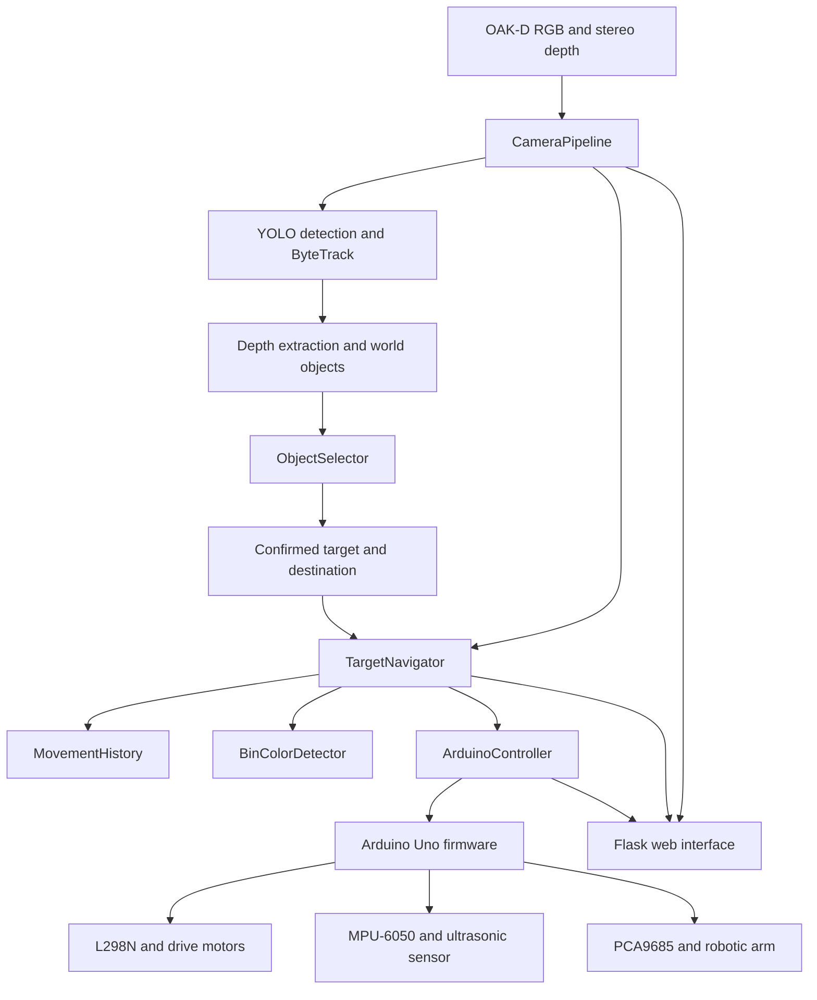

# Toy-Sorting Mobile Robot

An autonomous mobile robot that detects toy objects, selects and confirms a target, navigates to it, picks it up with a robotic arm, returns to its starting area, finds the assigned colored destination bin, releases the object, and automatically begins the next sorting cycle.

The system combines a Raspberry Pi 5, a Luxonis OAK-D depth camera, an Arduino Uno, an MPU-6050 IMU, an ultrasonic sensor, a four-wheel drive chassis, and a PCA9685-controlled robotic arm.

## Current Implementation Status

The current repository contains the complete software path for the autonomous sorting sequence:

1. Capture synchronized RGB and stereo-depth frames.
2. Detect toy objects with a custom Ultralytics YOLO model.
3. Track detections with ByteTrack.
4. Select the largest stable visible target.
5. Confirm the target across multiple frames.
6. Lock the object's class, destination, and destination-bin color.
7. Align with and approach the object.
8. Transfer final distance control from the camera to the ultrasonic sensor.
9. Position the robot for pickup.
10. Close the gripper and lift the object.
11. Estimate the outbound pose from movement history.
12. Return to the starting area.
13. Turn toward the destination-bin area.
14. Find and align with the locked colored bin.
15. Approach the bin using camera alignment and ultrasonic distance.
16. Release the object.
17. Back away, turn toward the object-search area, recalibrate the IMU, and clear the completed cycle.
18. Wait for the next confirmed target and repeat automatically.

A single navigation start can therefore continue into repeated sorting cycles. An unrecoverable safety or sensor error, confirmed target loss, or manual stop ends the active cycle and requires operator attention. Temporary far-range ultrasonic misses can be tolerated while camera guidance remains valid.

## Supported Object Classes and Destinations

| Detected class | Logical destination | Bin color |
|---|---|---|
| `animal` | `animal` | Yellow |
| `toy_car` | `toy_car` | Red |
| `building_block` | `building_block` | Blue |
| Low-confidence confirmed target | `discharge` | Black |

Normal targets must satisfy the standard confidence and confirmation requirements. A detection above the minimum threshold but below the normal confidence threshold requires additional confirmation frames and is routed to the black discharge bin.

## System Architecture



### Raspberry Pi Responsibilities

The Raspberry Pi performs high-level perception and behavior:

- Creates and runs the OAK-D RGB and aligned stereo-depth pipeline.
- Runs YOLO inference and ByteTrack tracking.
- Extracts median depth near each detection center.
- Maintains world-object information.
- Confirms a stable target and assigns its destination.
- Locks the carried object's class and destination-bin color.
- Makes camera-guided alignment and approach decisions.
- Records movement history and estimates the return pose.
- Detects colored bins with HSV masks and contour filtering.
- Coordinates pickup, return, delivery, release, reset, and repeated cycles.
- Hosts the Flask monitoring and control interface.

### Arduino Responsibilities

The Arduino performs direct hardware control:

- Controls the L298N motor-driver pins and PWM speeds.
- Executes timed forward and backward movements.
- Runs heartbeat-protected continuous forward movement.
- Reads and filters ultrasonic distance measurements.
- Reads and calibrates the MPU-6050 gyroscope.
- Performs IMU-controlled turns with stall and timeout detection.
- Controls the arm through the PCA9685 servo driver.
- Executes pickup positioning, grab, lift, and release sequences.
- Accepts an exact `STOP` command during interruptible operations.
- Returns structured serial responses to the Raspberry Pi.

## Perception and Target Selection

### Camera Pipeline

The active runtime camera implementation is `robot_project/camera/pipeline.py`.

It configures:

- RGB video at `640 x 480`.
- A target frame rate of `30 FPS`.
- Left and right mono cameras for stereo depth.
- Stereo depth aligned to the RGB stream.
- Left-right consistency checking.
- Subpixel disparity for improved depth precision.

The smaller `depth.py` and `device.py` files are standalone helpers and are not the main application pipeline.

### Object Detection and Tracking

`robot_project/detection/yolo.py` loads:

```text
models/oak/best.pt
```

Inference uses Ultralytics YOLO tracking with the custom ByteTrack configuration:

```text
config/trackers/bytetrack_robot.yaml
```

`robot_project/detection/detector.py` converts model results into dictionaries containing:

- Track ID.
- Class label.
- Confidence.
- Bounding box.
- Center coordinates.
- Median aligned depth near the center of the object.

### Target Confirmation

`robot_project/detection/object_selector.py` selects the detection with the largest visible bounding-box area. It does not choose the object with the smallest depth value.

The selected candidate must remain spatially consistent across consecutive frames. The current thresholds are:

- Minimum usable confidence: `0.20`.
- Normal confidence threshold: `0.40`.
- Normal confirmation: `5` frames.
- Uncertain-target confirmation: `8` frames.
- Maximum center movement between confirmations: `80` pixels.

Once confirmed, the selected target includes its label, average confidence, average distance, center position, destination, and confirmation-frame count.

## Navigation and Sorting Cycle

### Object Alignment and Approach

`robot_project/navigation/target_navigator.py` uses horizontal image error to align the robot with the target. It performs small IMU-controlled turns until the object is centered, then drives forward while continuing to monitor:

- Camera-target freshness.
- Bounding-box position and occupancy.
- Ultrasonic distance.
- Target loss.
- Misalignment.
- Implausible distance changes.
- Emergency distance limits.

At close range, the navigator can continue with ultrasonic guidance even after the object moves below the camera, but only after the camera target was previously centered and the handoff conditions are valid.

### Pickup

The Arduino performs final pickup positioning around a configured target of `5 cm`, with filtered ultrasonic measurements and multiple stable readings. The firmware rejects:

- Missing distance measurements.
- Unstable initial measurements.
- Sudden implausible jumps.
- A target outside the allowed pickup-start range.
- A target that becomes too close.
- A target that is lost during positioning.

After positioning, the arm opens, reaches toward the object, closes the gripper, and lifts the object into its carrying pose.

### Return to Start

All navigation turns and timed linear movements are recorded in `MovementHistory`.

The current return implementation:

1. Simplifies the outbound movement history.
2. Estimates the robot's final planar position and heading.
3. Calculates the bearing from that estimated position back to the origin.
4. Turns toward the origin.
5. Drives a calibrated estimated distance back.
6. Turns to the configured bin-facing heading.

This is dead reckoning, not exact reverse replay. Its accuracy depends on floor friction, wheel slip, battery voltage, motor consistency, and the configured distance-per-millisecond calibration.

### Bin Detection and Delivery

`robot_project/detection/bin_color_detector.py`:

- Converts the RGB frame to HSV.
- Applies the configured color mask.
- Uses morphological opening and closing.
- Finds the largest valid contour.
- Returns its bounding box, center, width, height, and area.

The navigator searches only for the bin color locked at the beginning of the cycle. It then aligns with that bin, approaches it with camera and ultrasonic checks, releases the object at the configured delivery distance, and begins the reset sequence.

### Automatic Reset

After a successful release, the robot:

1. Moves backward from the bin.
2. Turns `180 degrees` toward the object-search area.
3. Stops.
4. Recalibrates the IMU while stationary.
5. Clears movement history and completed-cycle state.
6. Clears the previous target lock.
7. Waits for a new confirmed target.
8. Starts the next cycle automatically.

## Safety Behavior

The project includes several software safety mechanisms:

- An immediate Raspberry Pi stop path that is separate from normal blocking commands.
- An exact Arduino `STOP` command that can interrupt timed movement, turning, pickup positioning, and arm wait periods.
- A continuous-forward heartbeat; the Arduino stops the motors if refresh commands stop arriving.
- Maximum movement durations and turn timeouts.
- IMU turn-stall detection.
- Camera-data freshness checks before navigation data is used.
- Camera-target loss and misalignment checks.
- Ultrasonic filtering, stability checks, range validation, and jump rejection.
- Emergency minimum-distance stops during object and bin approach.
- Servo angle constraints, including a gripper range of `95-170 degrees`.
- Destination locking so later detections cannot redirect an object already being carried.

Software checks do not replace safe electrical design or physical supervision. Keep the robot lifted from the floor during first movement tests, keep hands clear of the arm, and keep an accessible power-disconnect method.

## Hardware

- Raspberry Pi 5.
- Luxonis OAK-D depth camera.
- Arduino Uno.
- L298N dual H-bridge motor driver.
- PCA9685 16-channel PWM servo driver.
- MPU-6050 accelerometer and gyroscope.
- Ultrasonic distance sensor.
- Four DC TT motors and four-wheel chassis.
- Multi-servo robotic arm and gripper.
- Separate regulated power systems for computing, motors, and servos.

### Arduino Pin Assignment

| Function | Arduino pin |
|---|---:|
| L298N ENA | D6 |
| L298N ENB | D5 |
| L298N IN1 | D8 |
| L298N IN2 | D9 |
| L298N IN3 | D10 |
| L298N IN4 | D11 |
| Ultrasonic TRIG | D2 |
| Ultrasonic ECHO | D3 |
| I2C SDA | A4 on Arduino Uno |
| I2C SCL | A5 on Arduino Uno |

The MPU-6050 and PCA9685 share the I2C bus. They are distinguished by their I2C addresses.

### PCA9685 Servo Channels

| Joint | PCA9685 channel | Current software limits |
|---|---:|---:|
| Base | 0 | `0-180 degrees` |
| Shoulder | 4 | `0-180 degrees` |
| Elbow | 8 | `10-130 degrees` |
| Gripper | 12 | `95-170 degrees` |

Current gripper positions:

- Hold/grab: `100 degrees`.
- Open/release: `160 degrees`.

Do not widen servo limits without testing the joint mechanically with the horn disconnected from the mechanism first.

### Power Requirements

- Power the Raspberry Pi from its own suitable supply or UPS.
- Power the drive motors through the L298N motor supply.
- Power the servo rail through the PCA9685 `V+` terminal using a regulated supply suitable for the servos.
- Do not power the servo `V+` rail from the Arduino or Raspberry Pi 5 V pin.
- Connect PCA9685 logic `VCC` to the controller's logic supply; `VCC` and `V+` serve different purposes.
- Use a common ground between systems that exchange control signals.
- Avoid connecting two independent regulated 5 V outputs directly together.

## Software Stack

- Python 3.
- DepthAI.
- OpenCV.
- NumPy.
- Flask.
- Ultralytics YOLO.
- ByteTrack.
- PySerial.
- Arduino C++.
- I2Cdev and MPU6050 Arduino libraries.
- Adafruit PWM Servo Driver Arduino library.

Dependency versions are pinned in `requirements.txt`.

## Repository Structure

```text
RobotProject/
├── arduino/
│   ├── communication_test/
│   │   └── communication_test.ino
│   └── robot_controller/
│       └── robot_controller.ino
├── config/
│   └── trackers/
│       └── bytetrack_robot.yaml
├── models/
│   └── oak/
│       └── best.pt
├── robot_project/
│   ├── camera/
│   │   ├── depth.py
│   │   ├── device.py
│   │   ├── fps.py
│   │   └── pipeline.py
│   ├── detection/
│   │   ├── bin_color_detector.py
│   │   ├── detector.py
│   │   ├── object_selector.py
│   │   └── yolo.py
│   ├── hardware/
│   │   ├── arduino_controller.py
│   │   ├── serial_controller.py
│   │   ├── test_arduino_serial.py
│   │   └── test_movement_imu.py
│   ├── navigation/
│   │   ├── movement_history.py
│   │   └── target_navigator.py
│   ├── web/
│   │   ├── app.py
│   │   └── capture.py
│   ├── world/
│   │   ├── manager.py
│   │   └── object.py
│   └── config.py
├── tools/
│   ├── capture_dataset.py
│   └── split_dataset.py
├── main.py
├── requirements.txt
└── README.md
```

Files whose names end in `.issue6-backup` are historical working copies and are not imported by the active runtime.

## Installation

### 1. Clone the Repository

```bash
git clone https://github.com/LanaHawash/RobotProject.git
cd RobotProject
```

### 2. Create a Python Environment

```bash
python3 -m venv venv
source venv/bin/activate
python -m pip install --upgrade pip
pip install -r requirements.txt
```

### 3. Confirm the Model

The trained YOLO model must exist at:

```text
models/oak/best.pt
```

### 4. Upload the Arduino Firmware

Open and upload:

```text
arduino/robot_controller/robot_controller.ino
```

Required Arduino libraries:

- `I2Cdev`.
- `MPU6050`.
- `Adafruit PWM Servo Driver Library`.

The firmware uses:

```text
Baud rate: 115200
Default Raspberry Pi port: /dev/ttyACM0
```

Keep the robot completely still during startup IMU calibration.

### 5. Connect the Hardware

Before running the application:

- Connect the OAK-D camera to the Raspberry Pi.
- Connect the Arduino to the Raspberry Pi by USB.
- Confirm that the Arduino appears:

```bash
ls /dev/ttyACM*
```

- Confirm that the motor and servo power systems are correctly regulated.
- Lift the drive wheels from the floor for the first test after any firmware or wiring change.

### 6. Test Serial Communication

```bash
python robot_project/hardware/test_arduino_serial.py
```

The expected handshake is:

```text
ARDUINO_READY
PONG
```

`test_movement_imu.py` currently expects a legacy `RUN_TEST` firmware command that is not implemented in the active `robot_controller.ino`. Do not use that script as a current end-to-end firmware test without updating one side of the interface.

## Running the Robot

From the repository root:

```bash
source venv/bin/activate
python main.py
```

The Flask application listens on:

```text
0.0.0.0:5000
```

Open the interface from a device on the same network:

```text
http://<raspberry-pi-ip>:5000
```

Recommended startup procedure:

1. Place the robot at its defined starting position.
2. Keep the robot still while the Arduino calibrates the IMU.
3. Verify the camera stream and Arduino connection.
4. Place supported objects in the search area.
5. Place the red, yellow, blue, and black bins in the bin area.
6. Wait until the web status reports a confirmed target.
7. Start navigation.
8. Observe the first full cycle with immediate access to the stop control.

## Web Interface and Endpoints

| Endpoint | Purpose |
|---|---|
| `/` | Main annotated detection and robot-control page |
| `/video` | Annotated camera stream |
| `/depth` | Depth visualization stream |
| `/capture` | Dataset image-capture page |
| `/capture_video` | Raw camera stream for capture |
| `/save` | Save the current raw frame |
| `/status` | Combined camera, detection, Arduino, and navigation status |
| `/navigation/start` | Start the cycle using the current confirmed target |
| `/navigation/stop` | Stop the active navigation cycle |
| `/navigation/return` | Manually start return-to-origin behavior when allowed |
| `/navigation/status` | Detailed navigator state and movement history |

Captured web images are saved in:

```text
dataset/images/raw/
```

## Configuration and Calibration

### Main Configuration

Edit `robot_project/config.py` to change:

- Camera width, height, and frame rate.
- YOLO model path.
- Web host and port.
- Object-to-bin color mapping.
- HSV ranges for red, yellow, blue, and black bins.
- Minimum accepted bin contour area.

Red uses two HSV hue ranges because red wraps around the ends of the OpenCV hue scale.

### Navigation Calibration

Important values are defined near the top of `robot_project/navigation/target_navigator.py`, including:

- Camera-center and alignment tolerances.
- Object distance zones.
- Forward pulse durations.
- Camera-loss and handoff limits.
- Bin alignment and approach thresholds.
- Release distance.
- Return distance calibration.
- Post-release backward duration.

`CM_PER_MS` is currently a physical calibration value, not a universal constant. Re-measure it whenever the floor, battery condition, motor speed, wheel diameter, or robot mass changes.

### Arduino Calibration

Important values are defined near the top of `arduino/robot_controller/robot_controller.ino`, including:

- Drive and turn PWM speeds.
- Turn acceptance and stall thresholds.
- Pickup distance and tolerance.
- Ultrasonic validation limits.
- PCA9685 pulse range.
- Servo mechanical limits.
- Start, catch, lift, and release poses.

Test one subsystem at a time after changing these values.

### Bin-Color Calibration

HSV values are sensitive to:

- Lighting intensity and color temperature.
- Shadows and reflections.
- Bin material.
- Camera exposure.
- Distance from the bin.

Use the camera under the actual operating lighting, inspect the mask, and adjust the HSV ranges conservatively. Avoid broad ranges that cause the robot to lock onto the floor, walls, or unrelated objects.

## Dataset Utilities

### Web Capture

Use `/capture` and `/save` to collect raw camera images in:

```text
dataset/images/raw/
```

### Class-Specific Capture Tool

`tools/capture_dataset.py` opens the camera and saves images to the class configured in the script. Its current default class is `toy_car`.

Controls:

- `S`: save the current frame.
- `Q`: quit.

### Dataset Split Tool

`tools/split_dataset.py` creates deterministic training, validation, and test splits using an `80/10/10` ratio and random seed `42`.

Review its input and output directory constants before running it because it moves files.

## Known Limitations

- Return-to-start is open-loop dead reckoning; there are no wheel encoders or external localization.
- Return accuracy changes with wheel slip, floor material, motor differences, payload, and battery voltage.
- Bin detection depends on calibrated HSV ranges and controlled lighting.
- The serial device path is currently fixed to `/dev/ttyACM0`.
- The active model path is fixed to `models/oak/best.pt`.
- Target confirmation uses bounding-box size and spatial consistency rather than selecting the smallest depth value.
- The movement/IMU integration test script is not synchronized with the current firmware command set.
- `robot_project/config.py` defines `YOLO_CONFIDENCE_THRESHOLD = 0.25`, but `robot_project/detection/yolo.py` currently hard-codes `conf=0.20`; changing the configuration value does not change inference confidence yet.
- `tools/split_dataset.py` uses `dataset/labels/train` as both the raw-label source and training-label destination, so it can attempt to move a training label onto the same path. Review or correct the directories before using it.
- Historical backup source files remain in the repository and can make maintenance harder.
- There is no automated unit-test suite or continuous-integration workflow.
- Hardware faults, servo stalls, wiring faults, and power instability cannot be fully handled by software.


## Author

Lana Hawash  
Graduation Project
