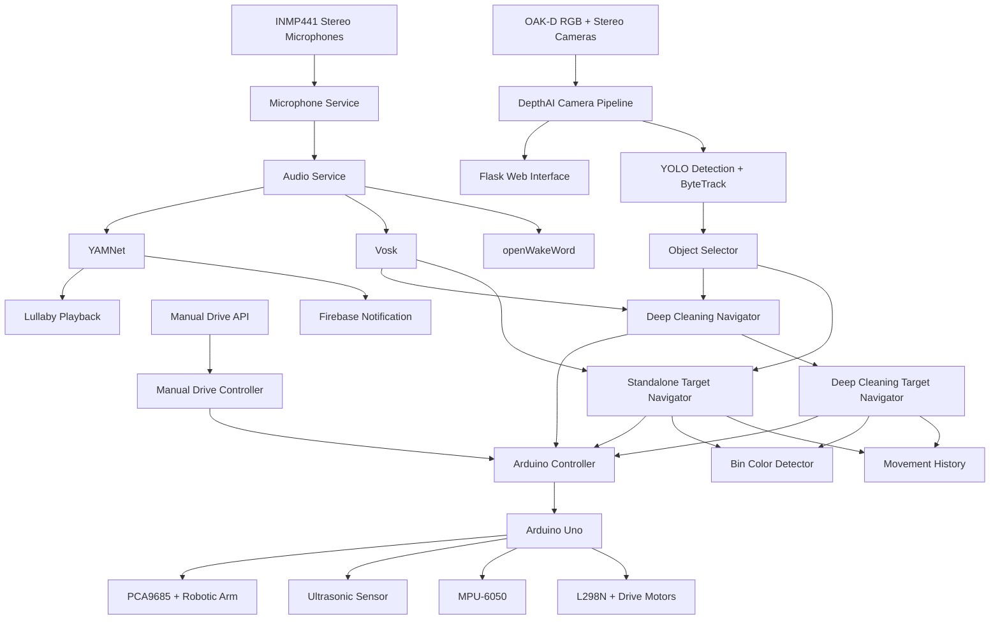

hreshold:     0.25
Command-listen period:  12 seconds
Audio chunk samples:    1280
```

Audio thresholds should be tuned using recordings from the actual robot environment.

Motor noise, fans, room echo, microphone placement, and speaker feedback can affect recognition.

---

# Development Notes

# RoboCare – Autonomous Toy-Sorting and Deep-Cleaning Robot

**Final Graduation Hardware Project**

RoboCare is an autonomous mobile robot built around a Raspberry Pi 5 and Arduino Uno. The robot combines computer vision, stereo depth, ultrasonic sensing, IMU-controlled motion, a robotic arm, voice interaction, baby-cry detection, Firebase notifications, manual remote driving, and a Flask-based monitoring interface.

This repository represents the final software implementation used for the completed graduation project.

---

## Main Capabilities

RoboCare currently supports:

1. **Autonomous toy sorting**
   - Detect objects using a custom Ultralytics YOLO model.
   - Track detections using ByteTrack.
   - Confirm stable objects over multiple camera frames.
   - Align with and approach a selected object.
   - Use ultrasonic sensing for final pickup positioning.
   - Pick up the object using a servo robotic arm.
   - Return toward the starting area.
   - Detect the correct colored destination bin.
   - Release the object.
   - Return toward the object-search environment.
   - Automatically wait for the next object.

2. **Deep-cleaning / zig-zag room navigation**
   - Traverse multiple room lanes.
   - Detect the end wall using the ultrasonic sensor.
   - Alternate lane direction.
   - Perform calibrated lane transitions.
   - Detect eligible objects while cleaning.
   - Pause the current cleaning lane when an object is confirmed.
   - Sort the object.
   - Return to the exact interrupted-lane origin using reverse movement replay.
   - Restore the original lane heading.
   - Resume the interrupted cleaning lane.

3. **Voice interaction**
   - Custom wake word: `Hey Robo`.
   - Spoken acknowledgement using `espeak-ng`.
   - Offline command recognition using Vosk.
   - Commands for starting navigation, starting deep cleaning, and stopping the robot.

4. **Baby monitoring**
   - Continuous YAMNet-based baby-cry detection.
   - Firebase Cloud Messaging notification.
   - Automatic lullaby playback.
   - Automatic microphone restart after playback.

5. **Manual remote driving**
   - Forward.
   - Backward.
   - Left.
   - Right.
   - Stop.
   - Manual driving is disabled while autonomous navigation is active.

6. **Web monitoring and control**
   - Live annotated RGB camera stream.
   - Depth visualization.
   - Navigation status.
   - Deep-cleaning status.
   - Dataset capture interface.
   - Emergency stop.
   - Manual-drive API.
   - Firebase device-token registration.
   - Live audio playback from a connected client through WebSocket.

---

# Hardware

The final robot uses:

- Raspberry Pi 5
- Luxonis OAK-D depth camera
- Arduino Uno
- L298N dual H-bridge motor driver
- Four DC TT motors
- Four-wheel mobile chassis
- MPU-6050 accelerometer and gyroscope
- Ultrasonic distance sensor
- PCA9685 16-channel PWM servo controller
- Multi-servo robotic arm and gripper
- Two INMP441 I2S microphones
- Speaker/audio-output device
- Separate regulated power paths for computing, motors, and servos

---

# System Architecture



---

# Raspberry Pi Responsibilities

The Raspberry Pi performs the high-level processing and behavior control.

It is responsible for:

- Running the OAK-D camera pipeline.
- Processing RGB and aligned stereo-depth frames.
- Running YOLO inference.
- Running ByteTrack.
- Confirming stable object candidates.
- Selecting navigation targets.
- Coordinating autonomous object approach.
- Maintaining movement history.
- Estimating standalone return-home movement.
- Detecting destination-bin colors.
- Coordinating pickup and release operations.
- Running the deep-cleaning zig-zag mission.
- Handling object interruptions during deep cleaning.
- Returning to interrupted cleaning lanes.
- Capturing stereo microphone audio.
- Detecting the `Hey Robo` wake word.
- Recognizing commands with Vosk.
- Running YAMNet baby-cry detection.
- Playing speech and lullabies.
- Sending Firebase notifications.
- Handling manual-drive commands.
- Hosting the Flask monitoring/control application.

---

# Arduino Responsibilities

The Arduino performs the low-level physical control.

It is responsible for:

- L298N motor control.
- Forward and backward timed movement.
- Continuous forward movement with a watchdog.
- Manual forward/backward/left/right driving.
- Manual-drive watchdog timeout.
- MPU-6050 gyro calibration.
- Closed-loop gyro-based turns.
- Ultrasonic distance measurement.
- Final ultrasonic pickup positioning.
- PCA9685 servo control.
- Robotic-arm pickup sequences.
- Robotic-arm release sequences.
- Emergency `STOP` handling.
- Structured USB-serial responses to the Raspberry Pi.

The Raspberry Pi communicates with the Arduino using:

```text
/dev/ttyACM0
115200 baud
```

---

# Computer Vision

## OAK-D Camera

The active camera pipeline runs at:

```text
Resolution: 640 x 480
FPS:        30
```

Stereo depth is aligned to the RGB camera so depth and RGB coordinates correspond.

The camera pipeline is implemented in:

```text
robot_project/camera/pipeline.py
```

---

# YOLO Object Detection

The active detector uses a custom Ultralytics YOLO model:

```text
models/oak/best.pt
```

The trained model is intentionally not stored in Git because `*.pt` files are ignored.

The active inference call uses:

```text
confidence threshold: 0.20
```

The custom ByteTrack configuration is located at:

```text
config/trackers/bytetrack_robot.yaml
```

ByteTrack is configured with persistent tracking between frames.

Each detection can contain:

- Object class
- Confidence
- Bounding box
- Image center
- Track ID
- Median stereo-depth estimate

Depth information is available for status/display purposes but is not required for the current camera navigation target.

---

# Object Selection

Object selection is implemented in:

```text
robot_project/detection/object_selector.py
```

The robot does not immediately select the first visible detection.

The selector checks whether approximately the same class remains spatially stable over several camera frames.

Current selection settings are:

```text
Minimum detection confidence:   0.20
Normal confidence threshold:    0.40
Normal confirmation frames:        5
Uncertain confirmation frames:     8
Maximum center movement:         80 px
```

Among valid detections, the selector prefers the object occupying the largest image area.

For normal-confidence detections, the destination is the detected object class.

For lower-confidence detections that still satisfy the minimum confidence and extended confirmation requirement, the destination becomes:

```text
discharge
```

The current confirmation logic primarily uses class and image-position consistency. Although ByteTrack IDs are generated by the detector, the active object selector does not use the track ID as its confirmation identity.

---

# Sorting Classes and Destination Bins

| Object / destination | Bin color |
|---|---|
| `animal` | Yellow |
| `toy_car` | Red |
| `building_block` | Blue |
| `discharge` | Black |

The `discharge` destination is used for uncertain but sufficiently confirmed detections.

## Deep-Cleaning Exception

`building_block` is intentionally excluded from object selection while deep-cleaning mode is running.

The camera may still detect and display a building block, but it will not interrupt deep cleaning.

This behavior is configured by:

```python
IGNORED_TARGET_LABELS = {
    "building_block",
}
```

in:

```text
robot_project/navigation/deep_cleaning_navigator.py
```

Standalone autonomous sorting can still use the configured blue `building_block` destination.

---

# Standalone Autonomous Sorting

Standalone target navigation is implemented in:

```text
robot_project/navigation/target_navigator.py
```

A normal sorting cycle performs approximately the following sequence:

```text
Confirm object
    ↓
Lock object class and destination
    ↓
Camera alignment
    ↓
Camera-guided approach
    ↓
Ultrasonic monitoring
    ↓
Ultrasonic pickup positioning
    ↓
Robotic-arm pickup
    ↓
Estimate return to starting area
    ↓
Face bins
    ↓
Find locked bin color
    ↓
Align with bin
    ↓
Approach bin
    ↓
Release object
    ↓
Return toward starting area
    ↓
Face object-search environment
    ↓
Clear previous cycle
    ↓
Wait for next confirmed object
```

---

# Object Approach

The target navigator initially aligns the selected object using its image position.

Important current thresholds include:

```text
Initial center tolerance:             70 px
Driving center tolerance:             95 px
Required centered updates:             2

Far distance:                         50 cm
Medium distance:                      30 cm
Pickup-positioning handoff:           15 cm
Camera-loss ultrasonic handoff max:   16 cm
Emergency distance:                    3 cm
```

The Arduino performs the final close-range pickup positioning.

Its target is approximately:

```text
Pickup target:     5 cm
Tolerance:         ±1 cm
```

The Arduino requires several stable ultrasonic measurements before accepting the final pickup position.

---

# Robotic Arm

The robotic arm is controlled by the Arduino through the PCA9685.

## PCA9685 Channels

| Joint | Channel | Software range |
|---|---:|---:|
| Base | 0 | `0–180°` |
| Shoulder | 4 | `0–180°` |
| Elbow | 8 | `10–130°` |
| Gripper | 12 | `100–170°` |

Important gripper positions in the final firmware include:

```text
Grip / carry:   120°
Open / release: 160°
```

Mechanical limits should not be widened without physically checking the arm.

---

# Movement History

Robot movement history is implemented in:

```text
robot_project/navigation/movement_history.py
```

The system records:

- Forward movement duration
- Backward movement duration
- Actual gyro-reported left turns
- Actual gyro-reported right turns
- Ultrasonic positioning pulses

Movement history is used differently by standalone navigation and deep-cleaning interruption recovery.

---

# Standalone Return-Home Navigation

Standalone autonomous sorting uses dead reckoning.

The system estimates:

```text
X position
Y position
Heading
Distance to origin
Bearing to origin
```

Linear distance is estimated from motor run time using:

```python
CM_PER_MS = 0.055
```

The return algorithm then turns once toward the estimated starting point and drives approximately straight back.

Current duration scaling is:

```text
Object-route return scale: 0.52
Bin-route return scale:    0.40
```

This return method is open-loop for translation because the robot does not use wheel encoders or an external localization system.

Gyro-reported turn angles are used for heading estimation, but translational error can still accumulate due to:

- Wheel slip
- Floor material
- Motor differences
- Battery voltage
- Payload
- Wheel diameter
- Mechanical alignment
- Timing calibration

---

# IMU Behavior

The Arduino calibrates its MPU-6050 gyro during startup.

Runtime recalibration between standalone sorting cycles is currently intentionally disabled:

```python
ENABLE_RUNTIME_IMU_RECALIBRATION = False
```

Therefore subsequent automatic sorting cycles continue using the startup gyro bias.

---

# Deep Cleaning / Zig-Zag Mode

Deep-cleaning navigation is implemented in:

```text
robot_project/navigation/deep_cleaning_navigator.py
```

Deep-cleaning object sorting is implemented separately in:

```text
robot_project/navigation/deep_cleaning_target_navigator.py
```

Standalone navigation and deep cleaning cannot run simultaneously.

---

## Zig-Zag Pattern

The robot starts in lane 1 and drives away from the bin side.

When the wall is reached:

1. Stop.
2. Turn toward the next lane.
3. Drive forward for the calibrated lane-shift duration.
4. Turn again in the same direction.
5. Enter the next lane.
6. Drive in the opposite longitudinal direction.

The lane-transition turn direction alternates:

```text
After odd lane  -> LEFT transition
After even lane -> RIGHT transition
```

Odd-numbered lanes travel:

```text
AWAY_FROM_BINS
```

Even-numbered lanes travel:

```text
TOWARD_BINS
```

---

# Current Deep-Cleaning Calibration

The current final source code uses:

```text
Wall stop distance:        25 cm
Maximum lane drive time:    8 seconds
First turn angle:          83°
Second turn angle:         83°
Lane shift duration:      350 ms
Maximum lanes:              4
```

These values are defined in:

```text
robot_project/navigation/deep_cleaning_navigator.py
```

The relevant constants are:

```python
WALL_STOP_DISTANCE_CM = 25.0
MAX_LANE_DRIVE_SECONDS = 8.0
FIRST_TURN_ANGLE_DEGREES = 83.0
SECOND_TURN_ANGLE_DEGREES = 83.0
LANE_SHIFT_DURATION_MS = 350
MAX_LANES = 4
```

These are physical calibration values and are specific to the final robot.

---

# Object Sorting During Deep Cleaning

Deep cleaning continuously checks for a confirmed eligible object.

If an object is detected while driving a lane:

```text
Drive lane
    ↓
Object confirmed
    ↓
Stop cleaning movement
    ↓
Store interrupted lane
    ↓
Sort one object
    ↓
Deliver object to its bin
    ↓
Reverse recorded movement route
    ↓
Return to interruption point
    ↓
Restore lane heading
    ↓
Validate lane identity/direction
    ↓
Resume same lane
```

Time spent sorting the object is excluded from the lane's eight-second movement safety timer.

---

# Deep-Cleaning Return Policy

Unlike standalone return-home navigation, the deep-cleaning sorter does not use dead-reckoning position estimation to return to the interrupted lane.

It uses:

```text
EXACT_REVERSE_REPLAY
```

The sorter records every movement made after the interruption point and then executes the literal inverse route in reverse order.

For example:

```text
FORWARD      -> BACKWARD
BACKWARD     -> FORWARD
TURN_LEFT    -> TURN_RIGHT
TURN_RIGHT   -> TURN_LEFT
```

After successful replay, the system verifies:

- Correct lane number
- Correct bin direction
- Correct lane travel direction
- Successful return to the interrupted lane
- Restored lane heading
- Correct `EXACT_REVERSE_REPLAY` return policy

Deep cleaning resumes only after these checks succeed.

---

# Obstacle-Avoidance Module

The repository contains:

```text
robot_project/navigation/obstacle_avoidance.py
```

This is an isolated experimental/demo helper that implements a fixed right-side detour and records the maneuver in `MovementHistory`.

However, in the current final runtime:

**`ObstacleAvoidance` is not imported or instantiated by `TargetNavigator`, `DeepCleaningNavigator`, or the main Flask application.**

Therefore obstacle avoidance is currently present in the repository but is **not an active autonomous-navigation feature**.

---

# Manual Driving

Manual driving is implemented by:

```text
robot_project/hardware/manual_drive_controller.py
robot_project/web/manual_drive_routes.py
```

Supported commands are:

```text
FORWARD
BACKWARD
LEFT
RIGHT
STOP
```

Commands are sent to the web API using:

```text
POST /movement
```

Example JSON:

```json
{
  "command": "FORWARD"
}
```

Manual movement is rejected while standalone autonomous navigation or deep cleaning is active.

The Arduino also has a manual-drive safety timeout:

```text
3000 ms
```

If no new manual command is received before the watchdog expires, the motors stop automatically.

---

# Audio System

Audio code is located under:

```text
robot_project/audio/
```

Important modules include:

```text
audio_service.py
config.py
cry_detector.py
microphone.py
speaker.py
speech_recognizer.py
wake_word.py
```

---

# INMP441 Microphones

The robot uses two INMP441 I2S microphones.

Current capture settings are:

```text
Sample rate:      16000 Hz
Input channels:   2
Model channels:   1
Sample format:    signed 16-bit PCM
Chunk size:       1280 samples
Microphone gain:  3.0
```

The configured input-device name is:

```text
inmp441
```

Stereo microphone samples are averaged into a mono signal before being passed to the AI models.

---

# INMP441 Device-Tree Overlay

The repository contains:

```text
inmp441-stereo.dts
```

This file defines the Raspberry Pi I2S stereo microphone configuration.

After configuring the overlay, verify the input device with:

```bash
arecord -l
```

The Python application expects the device to be visible to PortAudio / `sounddevice` using the name:

```text
inmp441
```

---

# Wake Word

Wake-word recognition uses:

```text
openWakeWord
```

The custom model is expected at:

```text
models/audio/openwakeword/hey_robo.onnx
```

Wake word:

```text
Hey Robo
```

Current wake-word threshold:

```text
0.03
```

After detecting the wake word, RoboCare temporarily stops microphone capture and says:

```text
How can I help?
```

using `espeak-ng`.

The microphones are then restarted and the robot listens for a command.

---

# Voice Commands

Command recognition uses offline Vosk speech recognition.

The Vosk model is expected at:

```text
models/audio/vosk/vosk-model-small-en-us-0.15/
```

Current supported commands are:

```text
start navigation
start deep cleaning
stop
```

The maximum command-listening period after the wake word is:

```text
30 seconds
```

`stop` invokes the system emergency-stop behavior.

---

# Baby-Cry Detection

Baby-cry detection uses YAMNet.

The YAMNet SavedModel must exist below:

```text
models/audio/yamnet/
```

The detector searches for a directory containing:

```text
saved_model.pb
```

The target YAMNet class is:

```text
Baby cry, infant cry
```

Current detection threshold:

```text
0.60
```

Approximately one second of audio is processed for each cry-detection window.

When crying is detected:

1. A Firebase notification is started asynchronously.
2. Microphone capture is stopped.
3. A lullaby is played.
4. Audio-service state is reset.
5. Microphone capture is restarted.

---

# Lullaby Playback

Lullabies are stored under:

```text
robot_project/audio/sounds/
```

Current audio files are:

```text
twinkle-twinkle-little-star.mp3
baby-shark.mp3
```

A song is selected randomly.

Playback uses:

```text
mpg123
```

The playback process is limited to approximately 20 seconds by the Python application.

---

# Live Talk

The Flask application also exposes a WebSocket endpoint:

```text
/audio/talk
```

Incoming raw mono audio is sent to:

```text
aplay
```

using:

```text
S16_LE
16000 Hz
1 channel
```

This allows a compatible client to play live audio through the robot's speaker.

---

# Firebase Notifications

Firebase Cloud Messaging is used for baby-cry notifications.

The Firebase service-account file must exist locally at:

```text
config/firebase-service-account.json
```

This file is excluded by `.gitignore` and must not be committed.

The main application does **not** contain a fixed FCM device token.

Instead, a client registers its current token at runtime using:

```text
POST /firebase/register-token
```

with:

```json
{
  "token": "<FCM_DEVICE_TOKEN>"
}
```

If no token has been registered, baby-cry notification sending is skipped.

## Firebase Test Script

The repository also contains:

```text
test_firebase_notification.py
```

This is a development/testing utility and should not be treated as production configuration.

Real FCM registration tokens should preferably be supplied through environment/local configuration rather than permanently committed to a public repository.

---

# Web Interface

The Flask server runs on:

```text
0.0.0.0:5000
```

Start the system with:

```bash
python main.py
```

Then open:

```text
http://<raspberry-pi-ip>:5000
```

---

# Web/API Endpoints

| Endpoint | Method / type | Purpose |
|---|---|---|
| `/` | GET | Main robot page |
| `/video` | GET | Annotated RGB stream |
| `/depth` | GET | Depth visualization |
| `/capture` | GET | Dataset capture page |
| `/capture_video` | GET | Raw capture stream |
| `/save` | GET | Save current camera frame |
| `/status` | GET | Overall system status |
| `/navigation/start` | GET | Start standalone sorting |
| `/navigation/stop` | GET | Stop standalone navigation |
| `/navigation/return` | GET | Trigger standalone return behavior |
| `/navigation/status` | GET | Detailed navigation status |
| `/deep-cleaning/start` | GET | Start zig-zag cleaning |
| `/deep-cleaning/stop` | GET | Stop deep cleaning |
| `/deep-cleaning/status` | GET | Deep-cleaning status |
| `/emergency-stop` | GET | Stop autonomous modes and motors |
| `/movement` | POST | Manual drive command |
| `/firebase/register-token` | POST | Register an FCM token |
| `/audio/lullaby/play` | GET | Manually play a lullaby |
| `/audio/talk` | WebSocket | Live speaker audio |

---

# Emergency Stop

The main software emergency-stop route is:

```text
/emergency-stop
```

It requests:

1. Standalone navigation stop.
2. Deep-cleaning stop.
3. Deep-cleaning object-sort stop when applicable.
4. Direct Arduino motor stop.

The Arduino also accepts the exact serial command:

```text
STOP
```

during long-running operations.

A physical power-disconnect method should still be available when operating or testing the robot.

---

# Arduino Pin Assignment

| Function | Arduino pin |
|---|---:|
| L298N ENA | D6 |
| L298N ENB | D5 |
| L298N IN1 | D8 |
| L298N IN2 | D9 |
| L298N IN3 | D10 |
| L298N IN4 | D11 |
| Ultrasonic TRIG | D2 |
| Ultrasonic ECHO | D3 |
| I2C SDA | A4 |
| I2C SCL | A5 |

The MPU-6050 and PCA9685 share the Arduino I2C bus.

---

# Power Requirements

Use separate regulated power paths where appropriate.

- Raspberry Pi: appropriate regulated Raspberry Pi supply / UPS.
- Motors: motor supply through the L298N.
- Servos: regulated servo supply connected to PCA9685 `V+`.
- PCA9685 logic: appropriate logic voltage connected to `VCC`.
- Communicating systems must share the required common ground.

Do not power the complete servo rail from an Arduino or Raspberry Pi GPIO power pin.

Do not directly connect independent regulated power-supply outputs together unless the power architecture is specifically designed for it.

---

# Repository Structure

```text
RobotProject/
├── arduino/
│   ├── communication_test/
│   │   └── communication_test.ino
│   └── robot_controller/
│       └── robot_controller.ino
│
├── config/
│   ├── trackers/
│   │   └── bytetrack_robot.yaml
│   └── firebase-service-account.json   # local / ignored
│
├── models/
│   ├── oak/
│   │   ├── README.md
│   │   └── best.pt                    # local / ignored
│   └── audio/                         # local / ignored
│       ├── vosk/
│       ├── openwakeword/
│       │   └── hey_robo.onnx
│       └── yamnet/
│
├── robot_project/
│   ├── audio/
│   │   ├── audio_service.py
│   │   ├── config.py
│   │   ├── cry_detector.py
│   │   ├── microphone.py
│   │   ├── speaker.py
│   │   ├── speech_recognizer.py
│   │   ├── wake_word.py
│   │   └── sounds/
│   │
│   ├── camera/
│   │   ├── depth.py
│   │   ├── device.py
│   │   ├── fps.py
│   │   └── pipeline.py
│   │
│   ├── detection/
│   │   ├── bin_color_detector.py
│   │   ├── detector.py
│   │   ├── object_selector.py
│   │   └── yolo.py
│   │
│   ├── hardware/
│   │   ├── arduino_controller.py
│   │   ├── manual_drive_controller.py
│   │   ├── serial_controller.py
│   │   ├── test_arduino_serial.py
│   │   └── test_movement_imu.py
│   │
│   ├── navigation/
│   │   ├── deep_cleaning_navigator.py
│   │   ├── deep_cleaning_target_navigator.py
│   │   ├── movement_history.py
│   │   ├── obstacle_avoidance.py
│   │   └── target_navigator.py
│   │
│   ├── web/
│   │   ├── app.py
│   │   ├── capture.py
│   │   └── manual_drive_routes.py
│   │
│   ├── world/
│   │   ├── manager.py
│   │   └── object.py
│   │
│   └── config.py
│
├── tools/
│   ├── capture_dataset.py
│   └── split_dataset.py
│
├── create_lullaby.py
├── inmp441-stereo.dts
├── test_firebase_notification.py
├── test_mics.py
├── main.py
├── requirements.txt
└── README.md
```

Files ending in names such as:

```text
.issue3-backup
.issue6-backup
```

are historical development copies and are not part of the active runtime.

---

# Installation

## 1. Clone the Repository

```bash
git clone https://github.com/LanaHawash/RobotProject.git
cd RobotProject
```

---

## 2. Install Required System Audio Packages

On Raspberry Pi OS:

```bash
sudo apt update

sudo apt install -y \
    portaudio19-dev \
    mpg123 \
    espeak-ng \
    alsa-utils
```

These packages provide:

```text
PortAudio -> Python sounddevice input
mpg123    -> lullaby playback
espeak-ng -> robot speech acknowledgement
aplay     -> live-talk playback
```

---

## 3. Create a Python Virtual Environment

```bash
python3 -m venv venv
source venv/bin/activate

python -m pip install --upgrade pip
pip install -r requirements.txt
```

---

## 4. Install the YOLO Model

Place the final trained YOLO model at:

```text
models/oak/best.pt
```

Verify:

```bash
python -c "from robot_project.config import YOLO_MODEL_PATH; print(YOLO_MODEL_PATH); print(YOLO_MODEL_PATH.exists())"
```

The final line should print:

```text
True
```

---

## 5. Install the Vosk Model

Expected path:

```text
models/audio/vosk/vosk-model-small-en-us-0.15/
```

---

## 6. Install the openWakeWord Model

Expected path:

```text
models/audio/openwakeword/hey_robo.onnx
```

---

## 7. Install YAMNet

The application expects:

```text
models/audio/yamnet/
```

to contain a TensorFlow SavedModel directory containing:

```text
saved_model.pb
```

---

## 8. Configure Firebase

Place the Firebase service-account JSON at:

```text
config/firebase-service-account.json
```

The file is excluded from Git.

Firebase initialization occurs during system startup, so this file must be available when running the full application.

A client FCM registration token must then be supplied through:

```text
POST /firebase/register-token
```

---

## 9. Configure the INMP441 Microphones

Install/configure the provided:

```text
inmp441-stereo.dts
```

device-tree overlay as required by the Raspberry Pi system.

Confirm the device:

```bash
arecord -l
```

The Python application expects an audio input device matching:

```text
inmp441
```

---

## 10. Upload Arduino Firmware

Upload:

```text
arduino/robot_controller/robot_controller.ino
```

to the Arduino Uno.

The firmware depends on:

```text
Wire
I2Cdev
MPU6050
Adafruit_PWMServoDriver
```

---

## 11. Verify Arduino Serial Communication

The Raspberry Pi application expects:

```text
/dev/ttyACM0
```

The Arduino should eventually report:

```text
ARDUINO_READY
```

and respond to:

```text
PING
```

with:

```text
PONG
```

Arduino connection failure is stored in the web status rather than terminating the entire Flask application.

---

# Running RoboCare

Activate the Python environment:

```bash
cd ~/RobotProject
source venv/bin/activate
```

Start the robot:

```bash
python main.py
```

The web application runs at:

```text
0.0.0.0:5000
```

From another device on the same network, open:

```text
http://<raspberry-pi-ip>:5000
```

---

# Recommended Startup Checks

Before autonomous operation, verify:

```bash
git status
arecord -l
ls models/oak/best.pt
ls models/audio/openwakeword/hey_robo.onnx
ls models/audio/vosk/vosk-model-small-en-us-0.15
ls config/firebase-service-account.json
```

Also confirm:

- OAK-D is connected.
- Arduino appears at `/dev/ttyACM0`.
- Motor and servo supplies are powered correctly.
- Robot starts in a safe physical location.
- The MPU-6050 remains stationary during startup calibration.

---

# Current Calibration Summary

## Standalone Navigation

```text
Camera size:                     640 x 480
Object center tolerance:          70 px
Driving center tolerance:         95 px
Pickup handoff distance:          15 cm
Arduino pickup target:             5 cm
Standalone distance conversion: 0.055 cm/ms
Object return duration scale:     0.52
Bin return duration scale:        0.40
Runtime IMU recalibration:        disabled
```

## Deep Cleaning

```text
Wall stop distance:               25 cm
Maximum lane driving time:         8 s
First transition turn:            83°
Second transition turn:           83°
Lane shift duration:             350 ms
Maximum lanes:                     4
Ignored class:        building_block
```

## Audio

```text
Sample rate:                    16000 Hz
Capture channels:                    2
Model channels:                      1
Wake-word threshold:              0.03
Command-listening timeout:          30 s
Baby-cry threshold:               0.60
Cry window:                          1 s
```

These values were tuned for the final physical robot and may need recalibration if the mechanical or electrical configuration changes.

---

# Current Limitations

The final project should be interpreted with the following implementation limits:

- Standalone return-home translation uses timed dead reckoning rather than wheel encoders.
- Translational error can accumulate because there is no external localization system.
- Runtime IMU recalibration between sorting cycles is currently disabled.
- Deep-cleaning interruption return uses exact reverse movement replay and is separate from the standalone dead-reckoning return system.
- `building_block` is intentionally ignored during deep-cleaning mode.
- `obstacle_avoidance.py` exists as an isolated experimental helper but is not connected to the active navigation runtime.
- Physical calibration values depend on the final robot, battery state, wheel behavior, and floor surface.
- Software emergency stop functionality should not replace safe electrical and mechanical design.

---

# Security Notes

The following should never be committed:

```text
config/firebase-service-account.json
.env
private credentials
private keys
```

These are already covered by the repository `.gitignore` where applicable.

Firebase client registration tokens should also preferably be supplied dynamically or through local configuration rather than permanently stored in public source files.

---

# Final Project Status

RoboCare was developed as a hardware graduation project integrating:

- Autonomous mobile robotics
- Computer vision
- Deep-learning object detection
- Stereo depth
- Embedded motor and servo control
- IMU-based turning
- Ultrasonic positioning
- Robotic manipulation
- Room-coverage navigation
- Voice recognition
- Environmental audio classification
- Firebase notifications
- Web and remote control

The repository represents the final completed implementation of the project.


---

# Author

Lana Hawash

Graduation Project
